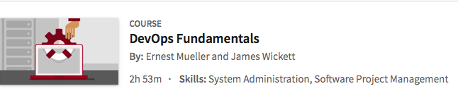

```
Roberto Nogueira  
BSd EE, MSd CE
Solution Integrator Experienced - Certified by Ericsson
```
# LinkedIn DevOps Fundamentals



**About**

Learn everything you need to about the subject of this `LinkedIn` project.

[Homepage](https://www.linkedin.com/learning/devops-fundamentals)

## Topics
```
Introduction
[ ] Welcome 1m 6s

1. DevOps Basics
[ ] What is DevOps? 3m 27s
[ ] DevOps core values: CAMS 3m 45s
[ ] DevOps principles: The three ways 5m 54s
[ ] Your DevOps playbook 3m 25s
[ ] 10 practices for DevOps success: 10 through 6 3m 40s
[ ] 10 practices for DevOps success: 5 through 1 4m 24s
[ ] DevOps tools: The cart or the horse? 4m 7s[ ]

2. DevOps: A Culture Problem
[ ] The IT crowd and the coming storm 4m 42s
[ ] Use your words 4m 2s
[ ] Do unto others 5m 26s
[ ] Throwing things over walls 6m 53s
[ ] Kaizen: Continuous improvement 4m 16s

3. The Building Blocks of DevOps
[ ] DevOps building block: Agile 4m 19s
[ ] DevOps building block: Lean 4m 10s
[ ] ITIL, ITSM, and the SDLC 5m 59s

4. Infrastructure Automation
[ ] Infrastructure as code 4m 41s
[ ] Golden image to foil ball 6m 53s
[ ] Immutable deployment 6m 59s
[ ] Your infrastructure toolchain 4m 39s

5. Continuous Delivery
[ ] Small + fast = better 4m 55s
[ ] Continuous integration practices 3m 51s
[ ] The role Of QA 4m 14s
[ ] Your CI toolchain 5m 22s

6. Reliability Engineering
[ ] Engineering doesn't end with deployment 3m 30s
[ ] Design for operation: Theory 4m 3s
[ ] Design for operation: Practice 5m 54s
[ ] Operate for design: Metrics and monitoring 5m 34s
[ ] Operate for design: Logging 3m 18s
[ ] Your SRE toolchain 4m 33s

7. Additional DevOps Resources
[ ] Unicorns, horses, and donkeys, oh my 5m 9s
[ ] The 10 best DevOps books you need to read 4m 35s
[ ] Navigating the series of tubes 3m 57s

8. The Future of DevOps
[ ] Cloud to containers to serverless solutions 5m 29s
[ ] The rugged frontier of DevOps: Security 6m 9s

Conclusion
[ ] Next steps: Am I a DevOp now? 5m 13s
```
